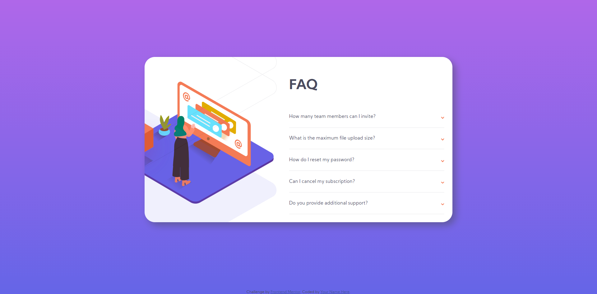

# Frontend Mentor - FAQ accordion card solution

This is a solution to the [FAQ accordion card challenge on Frontend Mentor](https://www.frontendmentor.io/challenges/faq-accordion-card-XlyjD0Oam). Frontend Mentor challenges help you improve your coding skills by building realistic projects. 

## Table of contents

- [Overview](#overview)
  - [The challenge](#the-challenge)
  - [Screenshot](#screenshot)
  - [Links](#links)
- [My process](#my-process)
  - [Built with](#built-with)
  - [What I learned](#what-i-learned)
  - [Useful resources](#useful-resources)
- [Author](#author)

ii
## Overview

### The challenge

Users should be able to:

- View the optimal layout for the component depending on their device's screen size
- See hover states for all interactive elements on the page
- Hide/Show the answer to a question when the question is clicked

### Screenshot

#### Mobile

#### Desktop

### Links

- Solution URL: [Add solution URL here](https://your-solution-url.com)
- Live Site URL: [Add live site URL here](https://your-live-site-url.com)

## My process

### Built with

- Base HTML5 markup
- CSS Flexbox
- Mobile-first workflow
- Vanilla JavaScript 

### What I learned

- I learn to make content loaded before HTML rendered with JavaScript

### Useful resources

- [15 ProJect Video](https://www.youtube.com/watch?v=3PHXvlpOkf4&t=10264sm) - In the menu section, he make DOMContentLoaded with JS, I apply that into this project

# Author

- Website - [Tin.Pham](https://github.com/tin-pham)
- Frontend Mentor - [@phambaohuy12345](https://www.frontendmentor.io/profile/phambaohuy12345)
- Facebook - [Tin Pham](https://www.facebook.com/joseph.webdev))
